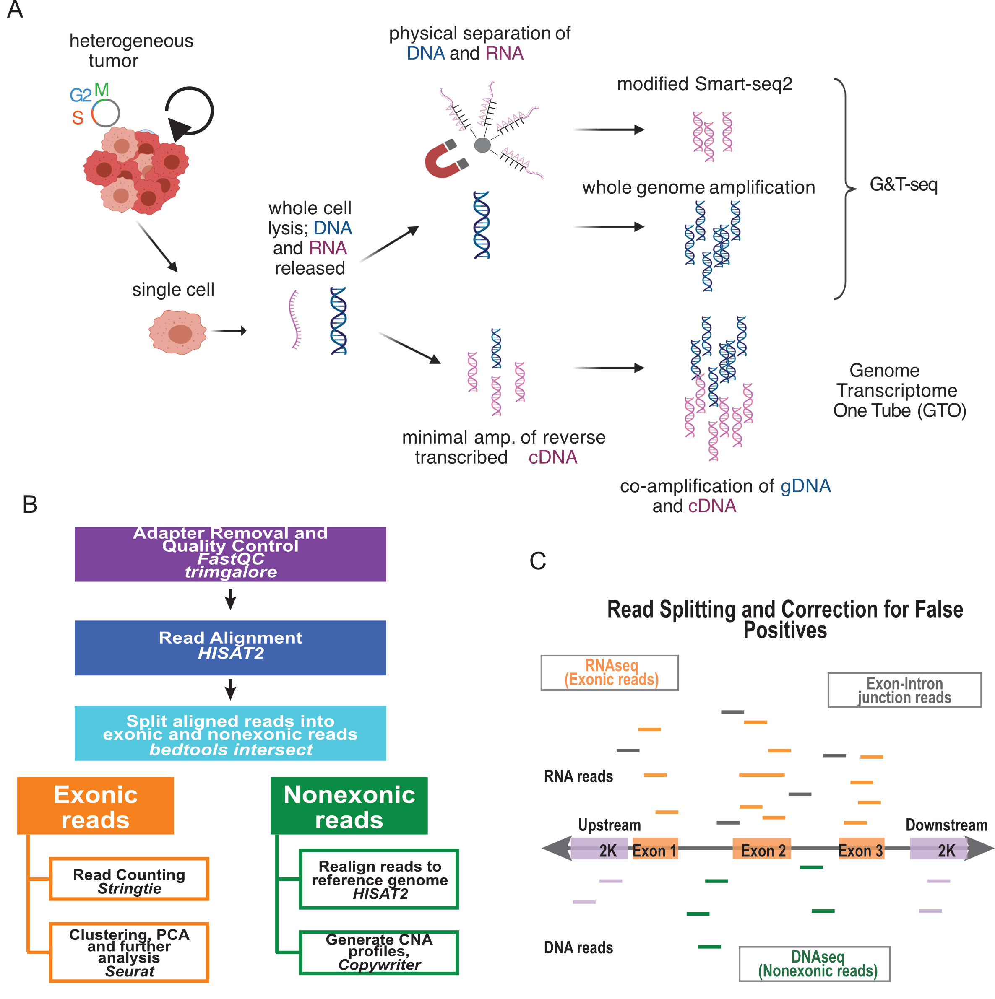
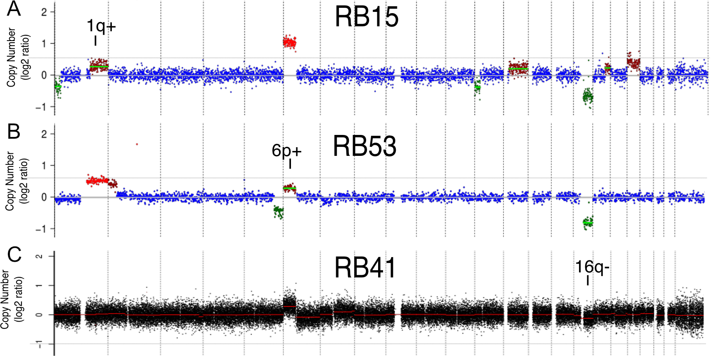
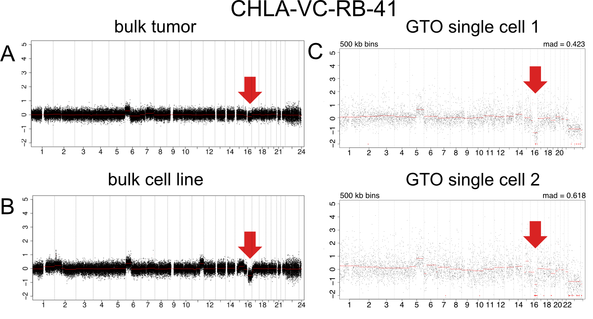
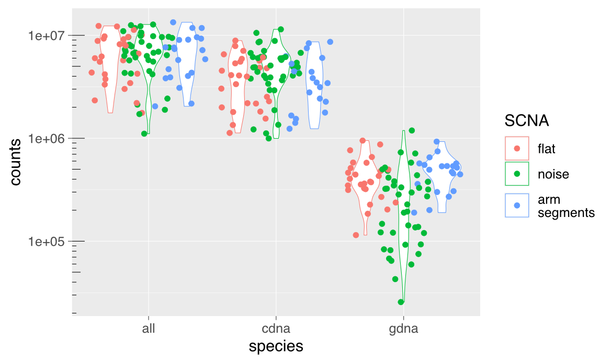
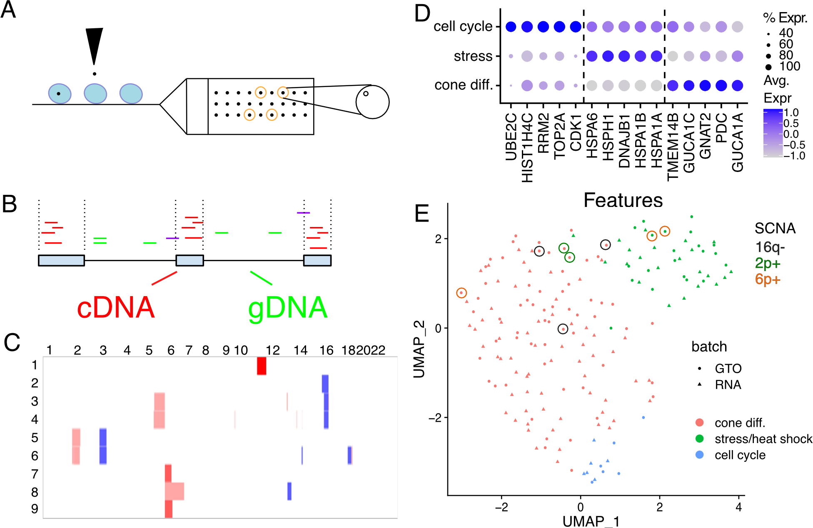

<!-- README.md is generated from README.Rmd. Please edit that file -->

```{r, include = FALSE}
knitr::opts_chunk$set(
  collapse = TRUE,
  comment = "#>"
)
```

# Simultaneous single cell DNA and deep full-length RNA sequencing using Genome Transcriptome One-tube (GTO) reveals subclonal heterogeneity in retinoblastoma tumors. 










