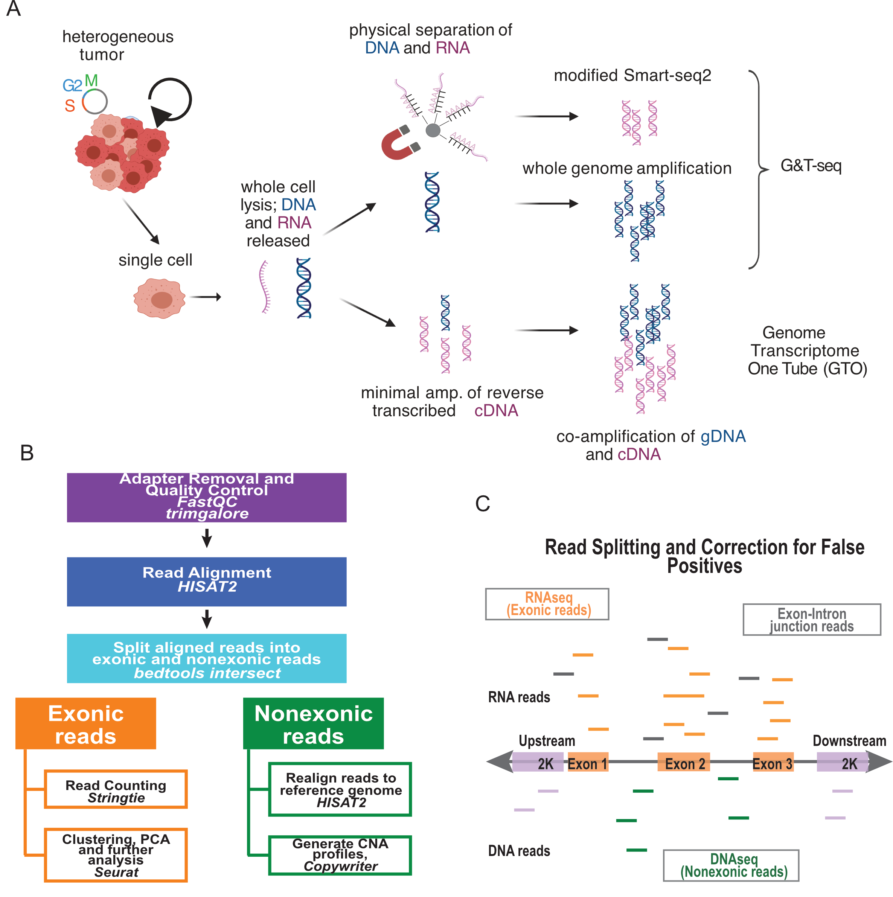
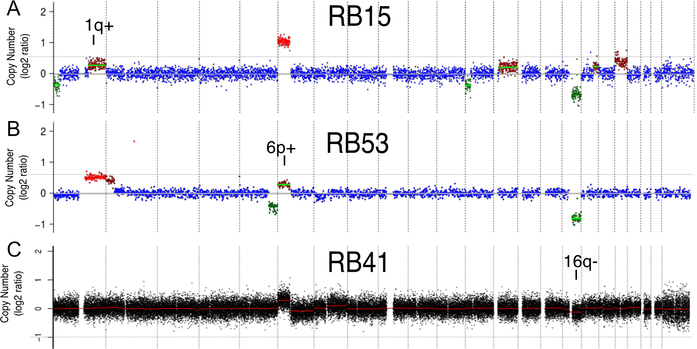
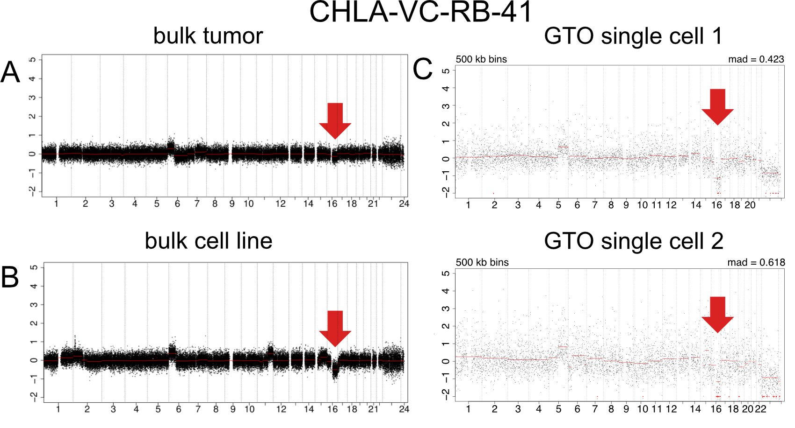
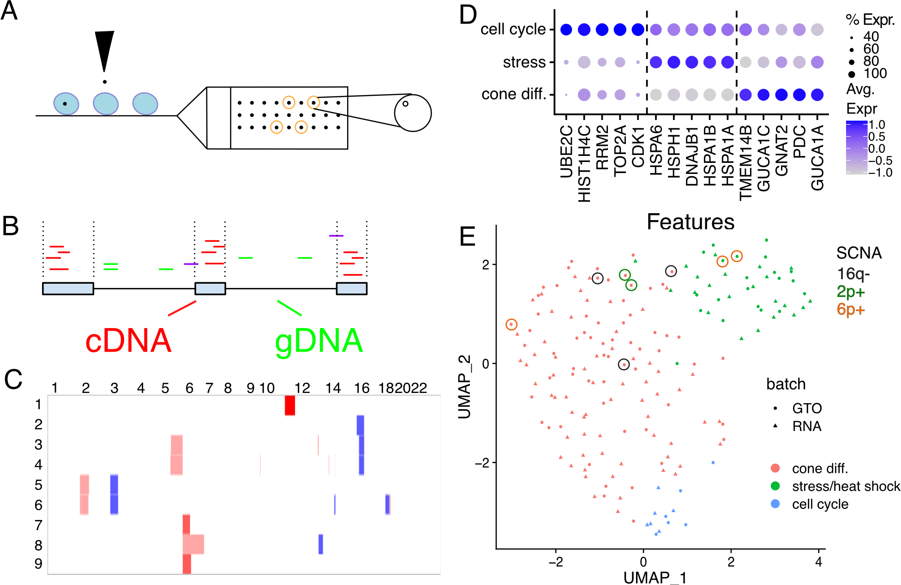

<!-- README.md is generated from README.Rmd. Please edit that file -->

# Simultaneous single cell DNA and deep full-length RNA sequencing using Genome Transcriptome One-tube (GTO) reveals subclonal heterogeneity in retinoblastoma tumors.

